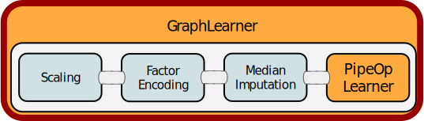
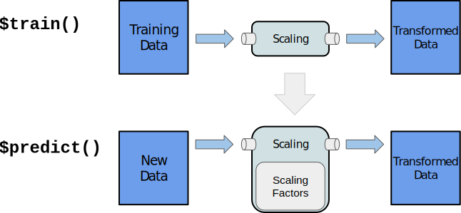
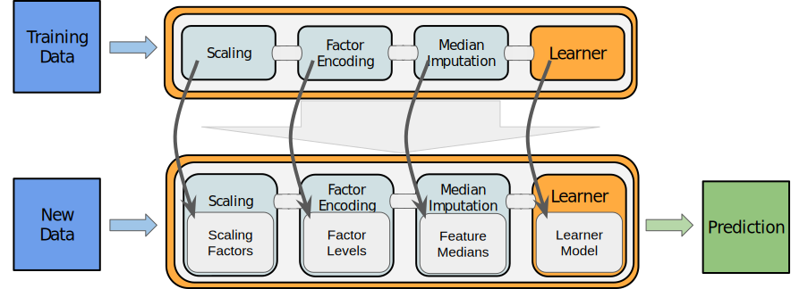
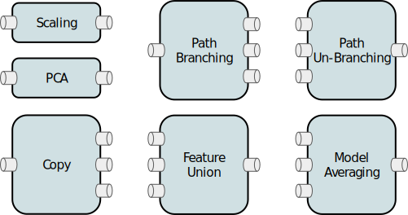
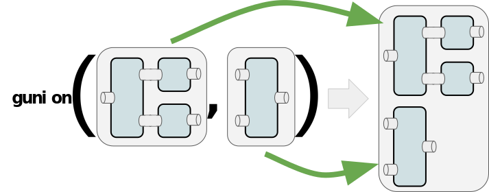
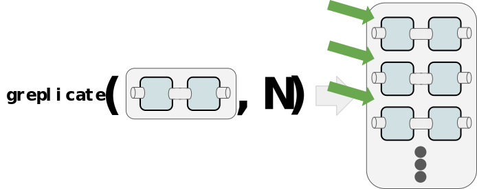

```{r, include = FALSE}
CHAR_WIDTH = 100
FIG_WIDTH = 9
FIG_HEIGHT = 4

library(paradox)
library(mlr3)
options(htmltools.dir.version = FALSE, width=80)
requireNamespace("fansi")
requireNamespace("icon") # remotes::install_github("ropenscilabs/icon")
options(
  crayon.enabled = TRUE,
  datatable.print.class = FALSE,
  datatable.print.keys = FALSE,
  width = CHAR_WIDTH
)
knitr::opts_chunk$set(
  #comment = NA,
  comment = "#",
  tidy.opts=list(width.cutoff=80),
  eval = T,
  width = CHAR_WIDTH,
  fig.height = FIG_HEIGHT,
  fig.width = FIG_WIDTH,
  fig.align = "center",
  dev = "svg",
  out.width = "90%",
  cache = FALSE # because it does not work wiht mlr3/R6
)
lgr::get_logger("mlr3")$set_threshold("warn")
```

class: middle left hide-count


.talk-meta[
.talk-title[
# Reproducible machine learning workflows
]

.talk-author[
Michel Lang, Bernd Bischl, **Jakob Richter**, **Patrick Schratz**, Martin Binder
]

.talk-location.i[
whyR conference, Warsaw
]

.talk-date.i[
September 27th, 2019
]
]

---

class: inverse, center, middle

# mlr3pipelines

---
# Pipelines

So far *mlr3* just modeled this part:
<div style="
    border: solid #ff0000 10px;
    width: 189px;
    height: 75px;
    position: fixed;
    left: 324px;
    top: 416px;"></div>
```{r fig_pipelines, echo = FALSE}
```

Step 1: Use pipelines for preprocessing (feature extraction/selection, missing data imputation etc.).
Step 2: Use pipelines for ensemble models.

---

# Preprocessing Pipelines

.pull-left[
We can put preprocessing *PipeOps* in front of a Learner



```{r, include=FALSE}
options(width = 54)
```
```{r}
library(mlr3pipelines)

mlr_pipeops
```

]

.pull-right[
Use **`%>>%`** to connect *PipeOps*:

```{r, warning=FALSE}
scale = po("scale") 
encode = po("encode")
impute = po("imputemean")
learner = po("learner",
  lrn("classif.kknn", 
    scale = FALSE))
grph = scale %>>% 
  encode %>>% 
  impute %>>% 
  learner
(glrn = GraphLearner$new(grph))
```

]

```{r, include=FALSE}
options(width = CHAR_WIDTH)
```

---

# Access Hyperparameters of PipeOps

fixme


---

# Train Graph Learner

.pull-left[
`r icon::fa("arrow-right")` Train the *GraphLearner* like every other mlr3 learner:

```{r}
tsk = tsk("iris")
glrn$train(tsk, 
  row_ids = seq(1, 150, 
    by = 2))
```

Most *PipeOps* have parameters (just like a trained model), that are learned from the training data:



]

.pull-right[

`r icon::fa("info-circle")` The scaling factors `center` $\mu$ and `scale` $\sigma$ are learned on the *training* data, and applied to new data that passes through the *PipeOp* for *prediction*.

```{r}
glrn$model$scale[c("center", 
  "scale")]
p = glrn$predict(tsk, 
  row_ids = seq(2, 150, 
    by = 2))
```
]

---

# Train Graph Learner (cont.)

1. `glrn$train()` passes the training data through all _PipeOps_.  
   Each *PipeOp* transforms the data and saves the transformation parameter.
2. `glrn$predict()` passes the new data through all _PipeOps_  
   Each *PipeOp* applies the transformation with the stored transformation parameters.  
   This ensures, that new data is transformed exactly as the training data.
   



---

# PipeOp Parameters

`r icon::fa("arrow-right")` Resample the complete preprocessing pipeline:

```{r}
rr = resample(tsk, glrn, rsmp("cv"), store_models = TRUE)
```


Each model is scaled according to its training data:

```{r}
rr$learners[[1]]$model$scale$center
rr$learners[[10]]$model$scale$center
```


`r icon::fa("info-circle")` Remember: Transforming the data before crossvalidating skews results. Transforming the data independently for training and test leads to wrong results!

---

# Tune Parameters of PipeOps

.pull-left[
We access the *PipeOp* hyperparameter through the parameter with its prefix in the *GraphLearner*.

```{r}
ps = ParamSet$new(list(
  ParamLgl$new("scale.scale"),
  ParamInt$new("classif.kknn.k",
    lower = 1, upper = 3)
))
```

`r icon::fa("info-circle")` *Grid search* terminates once the grid is completed, hence a termination criterion is optional.

```{r}
instance = TuningInstance$new(
  task = tsk("iris"),
  learner = glrn,
  resampling = rsmp("cv", folds = 3),
  measures = msr("classif.acc"),
  param_set = ps,
  terminator = term("none")
)
```
]

.pull-right[
```{r}
tt = tnr("grid_search")
tt$tune(instance)
instance$archive()[, .(scale.scale, 
  classif.kknn.k, classif.acc)]
instance$result_config
```
]

---

# Advanced Pipelines

Pipelines become exiting, once you can modify the path of the data using these *PipeOps*:

<div style="display: block;width: 150px;height: 130px;position: absolute;background-color: #FAFAFACC; left: 200px"></div>


**Branching** and **Copy** have multiple outputs, so the next *PipeOps* needs multiple inputs.
To create these...

---

# Branching

1. Combine multiple *PipeOps* one below each other:  
  .img70[]
2. Replicate a *PipeOp* N times one below each other:  
  .img70[]  
  `r icon::fa("info-circle")` This is especially useful to build bagged learners in combination with *model averaging* (`regravg` or `classifavg`) afterwards.
  
---

# Control Branching through Parameters

.pull-left[
```{r fig_branch, fig.keep='none'}
library(mlr3filters)

pca = po("pca", rank. = 2)
filter = po("filter", flt("variance"), 
  filter.nfeat = 2)

branch = po("branch",
  c("pca", "filter", "nop"))

union = gunion(
  list(pca, filter, po("nop")))

grph = branch %>>% 
  union %>>% 
  po("unbranch") %>>%
  po("learner", lrn("classif.kknn"))

plot(grph)
```
]

.pull-right[
```{r fig_branch, echo=FALSE, fig.width=0.5*FIG_WIDTH, fig.height=1.5*FIG_HEIGHT}
```
]

---

# Tune Branching

.pull-left[
```{r tune_branch}
glrn = GraphLearner$new(grph)

ps = ParamSet$new(list(
  ParamFct$new("branch.selection",
    levels = c("pca", "filter", "nop")),
  ParamInt$new("classif.kknn.k",
    lower = 1, upper = 3)
))

instance = TuningInstance$new(
  task = tsk("iris"),
  learner = glrn,
  resampling = rsmp("cv", folds = 3),
  measures = msr("classif.acc"),
  param_set = ps,
  terminator = term("none")
)
```
]

.pull-right[
```{r tune_branch_res}
tt = tnr("grid_search")
tt$tune(instance)
instance$result_config
```
`r icon::fa("info-circle")` Tuning hyperparameters of *PipeOps* that *can* be active needs dependent parameters. 
Check the [mlr3book paradox chapter](https://mlr3book.mlr-org.com/paradox.html).
]

---
# Build Ensemble with PipeOps

.pull-left[
Instead of branching we can *copy*, to use multiple *PipeOps* on the same data:
```{r graph_copy, fig.keep='none'}
grph = po("copy", 2) %>>% 
  gunion(list(
    po("learner_cv", lrn("regr.rpart")),
    po("nop")
  )) %>>%
  po("featureunion") %>>%
  po("learner", lrn("regr.lm"))
plot(grph)
```
]

.pull-right[
```{r graph_copy, echo=FALSE, fig.width=0.5*FIG_WIDTH, fig.height=1.5*FIG_HEIGHT}
```
]

---

# Compare Pipe to normal Learner

```{r}
glrn = GraphLearner$new(grph)
design = benchmark_grid(
  tasks = tsk("mtcars"), 
  learners = list(glrn, lrn("regr.lm")), 
  resamplings = rsmp("cv"))
bmr = benchmark(design = design, store_models = TRUE)
bmr$aggregate()[, -(1:3)]
```

---

# _PipeOps_ not covered by this tutorial

* Ensembles with `subsample`
* Feature generation with `mutate`
* Feature manipulation with `colapply`
* Feature selection with `select`
* Class balancing with `classbalancing`
* Prediction combining with `classifavg` and `regravg`
* and more.

`r icon::fa("info-circle")` Check the [mlr3book pipelines chapter](https://mlr3book.mlr-org.com/pipelines.html) for exhaustive explenations and more examples.

---

class: inverse, center, middle

# mlr3 Advanced Usage

---

# Internal Data Structure

All result objects (`resample()`, `benchmark()`, tuning, ...) share the same structure:

```{r}
as.data.table(rr)
```

---

# Internal Data Structure

#### Combining R6 and data.table
* Not the objects are stored, but pointers to them

* Inexpensive to work on:
  * `rbind()`: copying R6 objects &wedgeq; copying pointers
  * `cbind()`: `data.table()` over-allocates columns, no copies
  * `[i, ]`: lookup row (possibly hashed), create a list of pointers
  * `[, j]`: direct access to list element

---

# Control of Execution

`r icon::fa("arrow-right")` Parallelization
```{r, eval = FALSE}
future::plan("multicore")
benchmark(grid)
```
* runs each resampling iteration as a job<br/>
* also allows nested resampling (although not needed here)

`r icon::fa("arrow-right")`  Encapsulation

```{r, eval = FALSE}
ctrl = mlr_control(encapsulate_train = "callr")
benchmark(grid, ctrl = ctrl)
```
* Spawns a separate R process to train the learner
* Learner may segfault without tearing down the master session
* Logs are captured
* Possibility to have a fallback learner to create predictions

---

# Out-of-memory Data

* Task stores data in a `DataBackend`:
    * `DataBackendDataTable`: Default backend for dense data (in-memory)
    * `DataBackendMatrix`: Backend for sparse numerical data (in-memory)
    * `mlr3db::DataBackendDplyr`: Backend for many DBMS (out-of-memory)
    * `DataBackendCbind`: Combine backends thorugh `task$cbind(backend)` (virtual)
    * `DataBackendRbind`: Combine backends thorugh `task$rbind(backend)` (virtual)
    
* Backends are immutable
    * Filtering rows or selecting columns just modifies the "view" on the data
    * Multiple tasks can share the same backend
    
* Example: Interface a read-only MariaDB with `DataBackendDplyr`, add generated features via `DataBackendDataTable`

---

# Current state

https://github.com/mlr-org/mlr3/wiki/CI-Status
https://github.com/mlr-org/mlr3/wiki/Extension-Packages


Want to contribute?  
[mlr3.mlr-org.com](https://mlr3.mlr-org.com)

```{r xaringanthemer, include=FALSE, eval=FALSE}
library(xaringanthemer) # remotes::install_github("gadenbuie/xaringanthemer")
duo_accent(
  outfile = here::here("2019_whyr_warsaw/slides/assets/css/theme.css"),
  primary_color = "#03638e", secondary_color = "#f8f8f8",
  inverse_background_color = "#23373b",
  text_font_google     = google_font("Work Sans", "400", "300"),
  header_font_google   = google_font("Roboto Slab", "400"),
  code_font_google     = google_font("IBM Plex Mono", "300", "400"),
  code_font_size = "0.85em",
  title_slide_background_color = "#002733",
  link_color = "#eb1455",
  text_bold_color = "#00589a",
  text_font_size = "30px",
  header_color = "#002733",
  padding = "0em 2em 1em 2em"
)

extra_css = list(
    ".pkg" = list(
      "color"             = "#53804d",
      "font-weight"       = 300,
      "font-size"         = "95%",
      "font-family"       = "IBM Plex Mono",
      "padding "          = "1px 4px",
      "background-color"  = "#eff4ef",
      "border-radius"     = "4px",
      "border"            = "1px solid #82c878"
    ),
    ".hide-count .remark-slide-number" = list(
      display = "none"
    ),
    ".inverse h1" = list(
      "font-size" = "100px",
      "color" = "white"
    ),
    ".remark-slide-content h1" = list(
      "margin-top" = "10px"
    ),
    "pre" = list(
    "white-space" = "pre-wrap  /* Since CSS 2.1 */",
    "white-space" = "-moz-pre-wrap /* Mozilla, since 1999 */",
    "white-space" = "-pre-wrap  /* Opera 4-6 */",
    "white-space" = "-o-pre-wrap   /* Opera 7 */",
    "word-wrap" = "break-word  /* Internet Explorer 5.5+ */"
    ),
    ".code55" = list(
      "font-size" = "0.55em"
    ),
    ".code75" = list(
      "font-size" = "0.75em"
    ),
    ".font25" = list(
      "font-size" = "25px"
    )
)
write_extra_css(css = extra_css, outfile = here::here("2019_whyr_warsaw/slides/assets/css/extra.css"))
```

